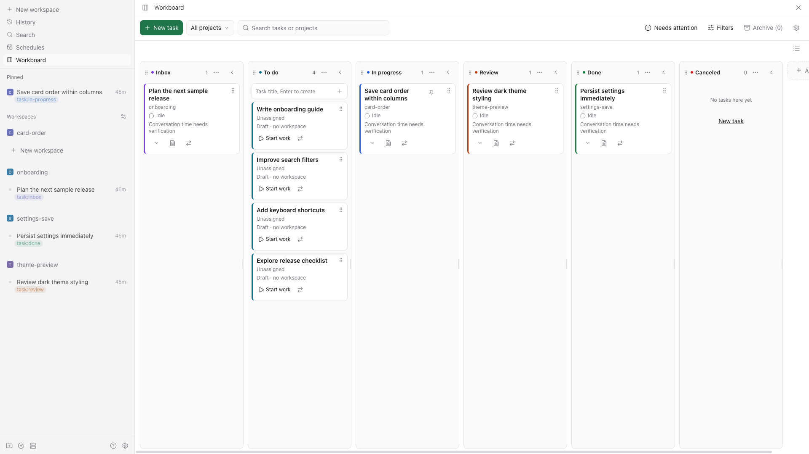

# Paseo Workboard

[中文](README.zh-CN.md) · [User guide](docs/user-guide.md) · [中文使用指南](docs/zh-CN/user-guide.md)

Workboard is a Paseo kanban plugin for workspaces and ideas. Each active workspace becomes one task. You can also capture a title-only draft first, then create or attach its workspace when you are ready to start.



## Highlights

- Import existing workspaces automatically, with one workspace represented by one task.
- Keep drafts without a workspace, directory, Agent, or conversation.
- Use groups and managed workspace labels as the task status; move cards or change a native label to update the same status.
- See Agent activity separately from task status. An Agent finishing does **not** complete a task.
- Follow Paseo's desktop language for Chinese and English UI text and dates.
- Review compact PR/MR, CI, and review-decision information supplied by Paseo.
- Reorder, resize, collapse, color, and locate desktop columns without changing task data. Narrow layouts use a single-group view and status menu.
- Choose independent defaults for new drafts, unlabeled workspace imports, and Start work (an In progress group).
- Save card order within each column by dragging; use up/down controls or Alt+Up/Down in narrow layouts. Restore activity order from the group menu.
- Optionally archive eligible completed or canceled workspaces after a configurable delay from their last verified conversation (30 days by default).

## Compatibility and trust

The minimum Paseo version is declared in `paseo-plugin.json`. Version 0.2.0 has isolated host integration coverage on Paseo 0.11.1; see [verification](docs/verification.md) for tested versions and remaining client checks.

The public plugin SDK does not expose all of Workboard's label and workspace operations. Workboard uses an internal bridge that reuses the host session. The manifest sets the minimum version; bridge responses are checked at runtime. New Paseo versions may require another compatibility update.

The plugin server runs with the daemon. Install it only after reviewing the source and treating it as trusted, unsandboxed local code.

## Installation

Install the source from GitHub into the selected Paseo daemon:

```sh
paseo plugin install github:fxbing/paseo-workboard
```

For local development or evaluation, install a checkout into the selected Paseo daemon:

```sh
npm ci
paseo plugin install /absolute/path/to/paseo-workboard
```

Enable plugins in Paseo, then open **Workboard** from the sidebar.

## Quick start

1. Open Workboard. Existing active workspaces appear as tasks. Workspaces without a managed status label enter **Inbox** without writing a label during import.
2. Create a draft with a title when you have an idea. It stays in **To do** and has no workspace yet.
3. Select **Start work** to create a workspace or attach an existing one. Start a conversation from the native workspace when needed.
4. Move a card between groups with the status menu or, on desktop, its drag handle. Managed labels and task status stay synchronized.
5. Configure labels, groups, automatic archiving, and optional sidebar pinning in **Settings**.

## Documentation

- [User guide](docs/user-guide.md): task flow, groups, board interaction, archive, pinning, and local preferences.
- [中文使用指南](docs/zh-CN/user-guide.md): the same guide in Chinese.
- [Contributing](CONTRIBUTING.md) · [中文贡献指南](CONTRIBUTING.zh-CN.md)
- [Architecture](docs/architecture.md) · [中文架构](docs/zh-CN/architecture.md)
- [Releasing](docs/releasing.md) · [中文发布](docs/zh-CN/releasing.md)
- [Verification](docs/verification.md) · [中文验证](docs/zh-CN/verification.md)

## Development

```sh
npm ci
npm run format:check
npm run check
npm run check:package
npm pack --dry-run
```

Use the [isolated integration fixture](tests/integration/README.md) for host-level checks. Do not load development builds into a personal daemon as a substitute for that fixture.

## Limitations

- The manifest sets the minimum Paseo version. The internal bridge may require changes in later releases; see [verification](docs/verification.md) for tested hosts.
- Automatic archival can stop Agents and terminals and may remove a managed worktree. Incomplete conversation history postpones automatic archival; Workboard cannot restore a native archive or a removed worktree.
- Native workspace labels, archive, and sidebar pins can change outside Workboard. The host does not expose every atomic operation, so uncertain operations are retained for manual review rather than retried destructively.
- The native mobile clients are not verified.

## License and acknowledgements

[MIT](LICENSE).

The project was inspired by [Paseo Thread Board](https://github.com/samgbafa/paseo-thread-board) and [Paseo Kanban](https://github.com/breathi3552/paseo-kanban).
